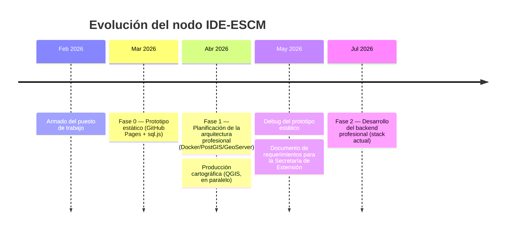

[⬅ Índice](../README.md) · [Siguiente ▶](01-introduccion.md)

# 0. Historia del proyecto

_Última actualización: 11/07/2026_

Este capítulo reconstruye la evolución real del proyecto, de punta a
punta, a partir del historial de trabajo (conversaciones de Google AI
Studio con timestamps reales + el desarrollo actual). Se agrega para que
quien se sume al proyecto — o una Secretaría que audite el avance —
entienda por qué la arquitectura es la que es, y no otra.

## Línea de tiempo

## Fase 0 — Prototipo estático (marzo 2026)

Antes de tener autorización para un servidor propio (por costo), el
proyecto arrancó como un **prototipo 100% estático pensado para GitHub
Pages**: sin backend, sin base de datos con servidor — los datos de las
tesis embebidos directamente en el repositorio.

La decisión original, tal cual se planteó en ese momento:

> "el entorno es GitHub (no me autorizaron el servidor remoto por el
> costo), por lo que no puede ser dinámico, debe ser estático, es un
> prototipo, luego haremos el profesional [...] toda la info y los
> geojson deben estar embebidos dentro del código de GitHub."

Con esa restricción se construyó un visualizador en el navegador que
leía un archivo SQLite (`tesis.db`) directamente desde JavaScript,
usando **sql.js** (SQLite compilado a WebAssembly) y un mapa base de
Esri. Esa fue la primera versión de la tabla `investigaciones` — la
misma estructura que hoy migramos a PostGIS (ver
[capítulo 7](07-migracion-sqlite.md)).

Este prototipo es el origen del archivo `tesis.db` que se usa en la
migración actual.

## Fase 1 — Planificación de la arquitectura profesional (abril 2026)

En paralelo a seguir cargando tesis en el prototipo estático, se
planificó la arquitectura "profesional" (la que se terminó
implementando). La hoja de ruta original definía tres herramientas de
IA para dividir el trabajo:

| Herramienta | Rol en el proyecto |
|---|---|
| NotebookLM | Consultor basado en la documentación técnica propia (manuales de GeoServer/PostGIS, requerimientos de la Escuela) |
| Google AI Studio (Gemini) | Arquitecto de sistemas: diseño de infraestructura, scripts de hardening Linux, esquemas de base de datos espaciales |
| Project IDX | Taller de codificación: visualizador de mapas (OpenLayers/Leaflet) y contenedores Docker |

Esa planificación ya definía correctamente los tres pilares que hoy
están implementados: **PostgreSQL+PostGIS, GeoServer (WMS/WFS) y Nginx
como proxy con SSL** — ver [capítulo 2](02-arquitectura.md).

## Actividad en paralelo — Producción cartográfica (abril 2026)

Durante el mismo período hubo trabajo docente/operativo en QGIS
(composición de Atlas, representación de polígonos) que no forma parte
del nodo IDE en sí, pero explica parte del tiempo invertido en el
proyecto en esas semanas.

## Documento de requerimientos institucional (mayo 2026)

El 27/05/2026 se redactó, aplicando la metodología del libro *Buenas
Prácticas en la Dirección y Gestión de Proyectos Informáticos* (Maigua y
López, UTN, 2012), un documento técnico de requerimientos para
presentar ante la Secretaría de Extensión y Vinculación Universitaria.
Ese documento es la base formal/institucional del proyecto — distinto de
este manual técnico, que documenta la implementación.

## Fase 2 — Backend profesional (julio 2026, actual)

A partir de julio 2026 se retoma el proyecto para construir efectivamente
la arquitectura planificada en la Fase 1: el stack Docker completo
(PostGIS, GeoServer, GeoNetwork, API propia, Nginx), la migración del
prototipo SQLite, y el cargador masivo de las 172 tesinas del repositorio
institucional. Es lo que documentan los capítulos 1 en adelante de este
manual.

## Cronograma de horas invertidas

El detalle sesión por sesión (fechas y horas reales, reconstruidas de los
timestamps del historial) y el Gantt semanal están en
`Planning_IDE-ESCM.xlsx` (fuera de este repo de documentación, se
comparte junto con los entregables de gestión de proyecto).

---
[⬅ Índice](../README.md) · [Siguiente ▶](01-introduccion.md)
