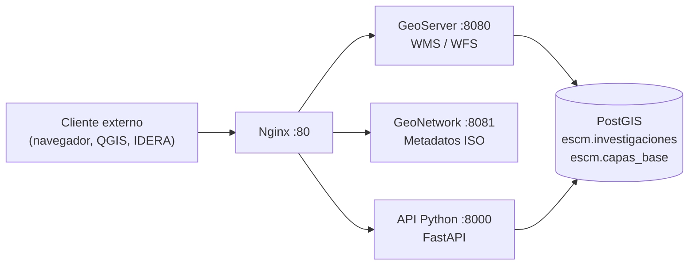

[⬅ Índice](../README.md) · [◀ Anterior](01-introduccion.md) · [Siguiente ▶](03-dimensionamiento.md)

# 2. Arquitectura general

_Última actualización: 10/07/2026_

El nodo se implementa como un conjunto de contenedores Docker
orquestados con Docker Compose, todos sobre una única red interna. Esto
permite reproducir el mismo entorno en una notebook de desarrollo, una
VM de pruebas, o el servidor institucional final, sin cambiar el código.

## Componentes del stack

| Servicio | Imagen / Tecnología | Función | Puerto |
|---|---|---|---|
| `postgis` | kartoza/postgis 15-3.4 | Base de datos espacial (PostgreSQL + PostGIS) | interno |
| `geoserver` | kartoza/geoserver 2.24.2 | Publica geoservicios OGC: WMS y WFS en tiempo real | 8080 |
| `geonetwork` | geonetwork 4.4.4 | Catálogo de metadatos ISO 19115/19139, cosechable por IDERA | 8081 |
| `api` | Python 3.12 + FastAPI | Orquestación propia: reglas de negocio, clasificación de datos | 8000 |
| `nginx` | nginx:stable-alpine | Proxy reverso, punto único de entrada (futura terminación HTTPS) | 80 |

> El puerto de PostgreSQL (5432) **no** se expone al host: solo es
> accesible dentro de la red interna de Docker.

## Diagrama lógico

## Flujo de una consulta típica

1. Un cliente externo (navegador, QGIS, o el portal de IDERA) pide un
   geoservicio o metadato a través de Nginx.
2. Nginx redirige internamente según el path:
   - `/geoserver/*` → GeoServer → consulta PostGIS → devuelve WMS/WFS.
   - `/geonetwork/*` → GeoNetwork → devuelve metadatos ISO.
   - `/api/*` → API en Python → consulta PostGIS → devuelve JSON.

---
[⬅ Índice](../README.md) · [◀ Anterior](01-introduccion.md) · [Siguiente ▶](03-dimensionamiento.md)
